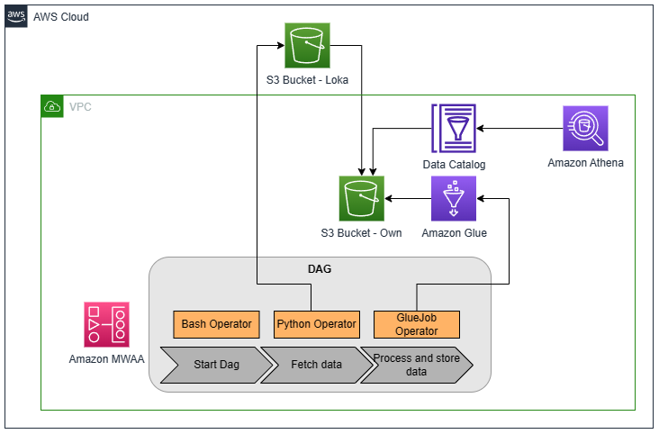
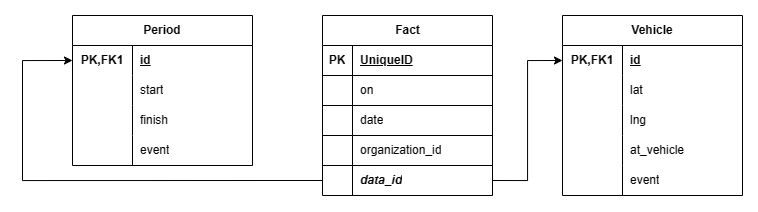

# door2door-de

This repository contains a solution to automate the build of a scalable data lake and data warehouse for Door2Door, a company that collects live position data from its fleet of vehicles via GPS sensors. The goal of this project is to enable the BI team to answer questions about the fleet's operations, such as the average distance traveled during an operating period. The solution fetches data from an S3 bucket on a daily basis, processes and extracts the main events that occurred during operating periods, and stores the transformed data in a SQL-queriable data warehouse.

## Requirements

* AWS CLI already configured with Administrator permission

## Architecture

## Data model

